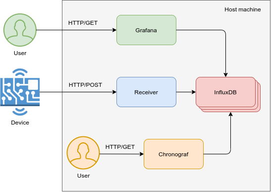

# Monitoring tool

## Architecture

Below is the main diagram


- Device periodically sends POST requests with JSON in format
```
{
    "parameter0": value0,
    "parameter1": value1,
    ...
    "parameterN": valueN
}
```
- Receiver gets content and puts all parameters into InfluxDB with the current timestamp.
- User can get the graphs of Grafana by going directly to the Grafana address in the browser.
- Chronograf is the user interface and administrative component of the InfluxDB 1.x platform.\
The component may be needed for debugging.\
**Note** that Chronograf does not support username/password authentication. Anyone who can connect to the service has full admin access. Consequently, the service is not publically exposed and can only be access via the loopback interface on the same machine that runs docker.
## Ports

The services in the app run on the following ports:

| Host Port | Service |
| - | - |
| 3000 | Grafana |
| 5000 | Receiver (Flask) |
| 127.0.0.1:8086 | InfluxDB |
| 127.0.0.1:8888 | Chronograf |

## Volumes

The app creates the following named volumes (one for each service) so data is not lost when the app is stopped:

* influxdb-storage
* chronograf-storage
* grafana-storage

## Database

The app creates a default InfluxDB database called `db0`.

## Data Sources

The app creates a Grafana data source called `InfluxDB` that's connected to the default IndfluxDB database (e.g. `db0`).

To provision additional data sources, see the Grafana [documentation](http://docs.grafana.org/administration/provisioning/#datasources) and add a config file to `./grafana-provisioning/datasources/` before starting the app.

## Dashboards

Grafana uses dashboard which located at `./grafana-provisioning/dashboards/maple_farm.json`.

To provision additional dashboards, see the Grafana [documentation](http://docs.grafana.org/administration/provisioning/#dashboards) and add a config file to `./grafana-provisioning/dashboards/` before starting the app.

## Query

Example of simple query string:
```
SELECT * FROM "db0"."autogen"."maple_farm"
```

## Easy way to install Docker

```
curl -sSL https://get.docker.com | sh
```
